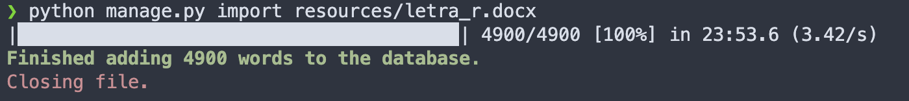

Dictio
======

Essa aplicação irá auxiliar na busca e criação de verbetes para um dicionário de latim.

Usage
-----

Para adicionar palavras usando um documento .docx, apenas execute `python manage.py import <filename>`

